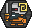
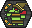
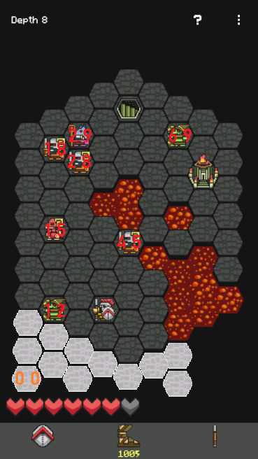
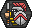

# An Empirical Study of Hoplite's Internal Rules

**Disclaimer: this document is unofficial and far from being complete.**

## 1. Terrain

The terrain is an hexagonal map made of 79 tiles, that are of two types:
 - the ground , on which the player can walk,
 - and the magma , where the player can not walk.

In each map there is one tile for the stairs  leading to the next level. Until depth 15 (included), each map also features an altar  that the player can pray at (only once). Player and demons may walk on the stairs, but not over the altar. Depth 16 features a fleece  that the player has to pick up before walking on the portal , escaping the dungeon and winning the game.

*Remark: this description only concerns the first 16 depths of the game,
available in the free version of the game.*

## 2. Demons

Demons are the enemies of the game. There are four types of them:

Name | Asset | In-game description
---- | ----- | -------------------
Footman |  | A resident of the underworld that is skilled in melee combat. It can only attack adjacent tiles.
Archer |  | A resident of the underworld that is skilled in ranged combat. It has a maximum range of 5 tiles and cannot attack adjacent tiles. It can only shoot in 6 directions.
Demolitionist |  | A resident of the underworld that is able to throw bombs. It has a range of 3 tiles. It can only throw a bomb every 3 turn.
Wizard |  | A resident of the underworld that is able to conjure beams of fire. It has a range of 5 tiles and will hit all tiles in range. It will avoid hitting other demons and cannot fire two turns in a row. It can only shoot in 6 directions.

### 2.1. Demon Attacks

At enemy's turn, each demon can either attack or move (but not both). Attacks always take priority over movement [[Developer's Discord]](https://discord.com/channels/692958702805975050/692958703229337661/704852139914035300).

The **footman** will attack (i.e. inflict one damage) whenever it is in a tile adjacent to the player's, after any player move and its consequences.

The **archer** will throw an arrow whenever the player is in its range area. This area is determine by six lines, one for each hexagonal direction (vertical, diagonal north-west / south-east, diagonal south-west / north-east). The archer can not shoot to a directly adjacent tile, and not beyond a 5 tile radius. Also, throwing an arrow requires a clear view: the archer can not shoot through an altar or another demon. The archer may throw an arrow every turn that satisfies those conditions.

The **demolitionist** will throw a bomb  in a range of three tiles. It has to wait two full turns before being able to throw again. It will not throw a bomb to a tile adjacent to a demon [[Developer's Discord]](https://discord.com/channels/692958702805975050/692958703229337661/704958237224730654) [[Developer's Blog]](http://www.magmafortress.com/2015/03/hoplite-challenge-mode-is-ready.html).

The **wizard**, as the archer, has a range attack effective on the six hexagonal directions, with a maximum range of five tiles, having clear sight. Unlike the archer, it can shoot a tile directly adjacent to him. Though, it has two limitations:
- the wizard has a one turn cooldown between two attacks,
- the wizard will not shoot if its beam would reach a demon in the 5 tile range (meaning if there is a demon in reach behind the player, then wizard will not shoot) [[Developer's Blog]](http://www.magmafortress.com/2015/03/hoplite-challenge-mode-is-ready.html).

Here is a representation of the archer and the wizard ranges:


### 2.2. Turn

Turn is split into following stages:
1. Player move(walk, attack, leap, bash, etc.)
1. Bombs explode
1. Demons attack player
1. Demons walk

**Note: Demon cannot walk and attack at the same turn.**

Because attacking player takes precedense before walking, therefore demons cannot block other demons from attacking.

As will be explained in next subsection demons move in some order and attacking probably works in same way.

Checked situations:
- depth 1 (order (footman)->(archer), never seen it any other way), player has 1 health and is attacked by footman and archer at the same time. 
Animation show that footman attack first and archer later. Death message `You were killed by a demon archer.`.
- depth 1 (order (footman)->(archer), never seen it any other way), player has 2 health and is attacked by footman and archer at the same time. 
Animation show that footman attack first and archer later. Death message `You were killed by a demon archer.`.

Possible explanation for this is that last demon to hit is mentioned in death message, but to reach more concrete conclusions more experiments are necessary.

**Note: Attacks Animations seem to start in order, thus it is possible to deduce order using them.**

### 2.3. Order
Demons move in specified at the begging of the depth order. If any demon dies, demon at the end of the order replaces its postion.
In game coordinates of demons is defined like this:

**Example order and how it changes**:
```
[depth 6]
footman(8,6) -> archer(7,5) -> footman(6,7) -> demolitionist(1,5) -> footman(0,7) -> wizard(8,8)
(killed footman)
wizard(6,6) -> archer(6,5) -> footman(8,5) -> demolitionist(2,5) -> footman(3,5)
(killed archer)
wizard(7,6) -> footman(4,5) -> footman(8,4) -> demolitionist(2,5)
[...]
```

How to get order of demons movement:
1. Reading memory - It should be possible to read demons movement order, but it's not technique used in this project.
2. Reverse enginering - Actual method used for this analysis and program.
3. Use in-game mechanics
- attack animations
- movement

**Movement order and why it is important**
example calculation of movement of demons and theirs order

### 2.4. Demon Movements
Priority list chose first that work else go next.
**footman**:
1. Attack if player adjecent
2. Randomly move to one hex that reduces distance to player(distance is calculated using map without demons)
3. Randomly wait or move to hex that has equal distance to player. Probabilities are split treating wait as one move. If there are to walk moves possible and one wait, all will have 1/3 probability.
If there is no path then wait(need proof).

**archer** 
1. Attack if player is in same hexagonal line and in range from 2 to 5 and there is no demon between.
2. Walk to hex or wait on hex that is in range to shoot the player and is nearest hex that is in range 3 from player. Hex cannot be stairs or spear. 
3. Walk to hex or wait on hex that is in range to shoot the player and is nearest hex that is in range 3 from player. 
4. Randomly walk to hex that reduce range to field with range 3 from player. Hex cannot be stairs or spear.
5. Randomly walk not changing range from player. Hex cannot be stairs or spear.
6. Wait.

**demolitionist**
1. Throw bomb to hex that is adjacent to player and in range 3 from demolisher and is not adjacent to any other demon and has bomb.
2. (needs checking) Walk to hex or wait on hex that is in range to shoot the player and is nearest hex that is in range 3 from player. Hex cannot be stairs or spear.
3. (needs checking) Walk to hex or wait on hex that is in range to shoot the player and is nearest hex that is in range 3 from player.
4. Randomly walk to hex that reduce range to field with range 3 from player. Hex cannot be stairs or spear.
5. Randomly walk not changing range from player. Hex cannot be stairs or spear.
6. Wait.

Gets Charge every not attacking turn. Needs two charges to attack.

**wizard**
1. Attack if player is in same hexagonal line and in range from 1 to 5 and there is no demon in range and is charged.
2. Walk to hex or wait on hex that is in range to shoot the player and is nearest hex that is in range 3 from player. Hex cannot be stairs or spear.
3. Walk to hex or wait on hex that is in range to shoot the player and is nearest hex that is in range 3 from player.
4. Randomly walk to hex that reduce range to field with range 3 from player. Hex cannot be stairs or spear.
5. Randomly walk not changing range from player. Hex cannot be stairs or spear.
6. Wait.

Gets Charge every not attacking turn. Needs one charge to attack.

**TODO**

### 2.5. Demon Status

**TODO**

## 3. Player

The player is a Greek hoplite .

### 3.1. Status

#### 3.1.1 Health

The player has a health bar composed of two values: the maximum health and the current health. At the beginning of the game, the player starts with 3 hearts out of 3. Each damage dealt by a demon decreases the current health by 1. When this amount reaches 0, the player dies and looses. Finishing a level does not heal the player. Here are the ways of restoring health:
- the prayer "Divine Restoration" will restore all health up to the maximum health,
- the prayer "Fortitude" will increase the maximum health by one and also increase the current health by one,
- with the prayer "Regeneration", killing in three consecutive turns will restore one heart (until the maximum health is reached), once per depth.

The maximum health can not exceed 8 hearts, meaning "Fortitude" prayers are unavailable if the player already has a maximum health of 8 hearts.

<!---

--->

#### 3.1.2. Energy

The player has an energy bar similar to the health one: it has a current value and a maximum value. At the beginning of the game, the player starts with 100 energy out of 100. Leaping consumes 50 energy (if the player does not have that amount of energy, it can not leap). Here are the ways of restoring energy:
- going to the next level restores all the energy,
- walking (or leaping) to a tile with an adjacent demon will restore 10 energy [[Developer's Blog]](http://www.magmafortress.com/2013/09/hoplite-20.html),
- with the prayer "Bloodlust", each kill (stab, lunge, throw, bashed into lava, crushed, or explosion from a bashed bomb) will restore 6 energy,
- with the prayer "Surge", killing in three consecutive turns will restore 100 energy
- the prayer "Greater Energy" will increase the maximum energy by 20, and also increase the current energy by 20
- the prayer "Greater Energy II" will increase the maximum energy by 15, and also increase the current energy by 15

<!---

--->

#### 3.1.3. Bash Cooldown

When the player uses the bash move, it starts a cooldown before being able to use it again. This cooldown starts at 4 turns, decreasing by one after each enemy turn: the player has to wait 3 full turns before bashing again.

The prayer "Quick Bash" reduces the cooldown starting value to 3 turns. With the prayer "Surge", killing in three consecutive turns will reset the cooldown, making bashing available again.

### 3.2. Moves

Each turn, the player performs one of the following moves:

#### 3.2.1. Walk

Walking to an adjacent tile, if it is not magma, and if there is no demon, bomb nor altar on it. If this tile happens to be the stairs, then the player goes to the next level. Walking triggers two attacks:

Attack | In-game description
------ | -------------------
Stab | Stabs are performed automatically based on your movement relative to demons. A demon will be stabbed any time you move between two tiles adjacent to that demon.
Lunge | You will lunge automatically whenever moving directly toward a demon. Leaping toward a demon also trigger a lunge attack. Lunge only hits demons you move directly toward. You cannot lunge while your spear is on the ground.

#### 3.2.2. Leap

Jumping to a remote tile, if it is not magma, and if there is no demon, bomb nor altar on it. This consumes 50 energy, and so is only available when the player has at least this amount of energy. Leaping triggers the stab and lunge attacks.

A player can not leap to a tile directly adjacent to its position (that would be walking). Default leap distance is 2. This can be increased by one with the prayer "Winged Sandals".

With the prayer "Staggering Leap", demon adjacent to the tile the player lands on are stunned.

#### 3.2.3. Bash

Bash is only available if its cooldown is at zero. Bashing a tile knocks back entities (demons and bombs) around. After that, the cooldown starts (by default at 4 turns) preventing the player from bashing again. Bash can be used to skip a turn if it is really necessary. The precise knocking mechanism can be a little complex; here is how it works:

1. Determine which tiles are bashed:
 - by default, only the tile clicked on is bashed,
 - with the prayer "Sweeping Bash", an arc of tiles is bashed, centered on the clicked tile,
 - with the prayer "Spinning Bash", all tiles adjacent to the player are bashed.
2. For each bashed tile:
 1. Consider the direction from the player to the bash tile, and look at the next tile A on that line. If there is not any demon or bomb on it, then this bashed tile is ignored.
 2. Otherwise, the target A is pushed to the next tile B in the computed direction:
    - if there is an altar on B, then nothing happens,
    - if B is out of the map:
        - if the target is a demon then it gets crushed (i.e. killed, counting as a player kill),
        - and if it is a bomb then nothing happens,
    - if the target is a demon and B a magma tile, the demon is killed (counting as a player kill) [[Developer's Blog]](http://www.magmafortress.com/2014/07/hoplite-23-progress.html),
    - otherwise:
        1. if B is occupied by a demon, this demon is **pushed away**,
        2. the target A is moved to B.
 3. Repeat the previous step if the player has made the prayer "Mighty Bash", increasing the knockback distance to 2.

The mechanism to **push away** a demon has been [described by the developer on Reddit](https://www.reddit.com/r/Hoplite/comments/fxx69q/will_i_fall_into_lava_if_i_bashreaction_how_does/fn9ntxe/?context=3). The game looks for empty tiles in the following order:


The game looks for empty an empty tile in 1, and if not in 2 and 2' in random order. If it finds an empty tile (magma counts as empty, killing the demon), the demon is moved there. Otherwise, the demon in tile 1 is pushed away using the same algorithm, then the first demon is moved to tile 1. If a demon needs to be pushed away but has nowhere to escape (i.e. no demon can be pushed to make room for it), then it gets crushed.
If demon is bashed through lava it burns and dies.

#### 3.2.4. Throw

If the player has its spear, it may throw it to a tile in a given radius. This radius is 2 by default, but prayers "Greater Throw" and "Greater Throw II" both increase this radius by one.

After having thrown the spear, the player can not lunge anymore. Also, it will not be able to go through the stairs: it has to pick up the spear first, by walking (or leaping) on it.

#### 3.2.5. Others

If the player has made the prayer "Patience", it can idle and make no move, effectively skipping its turn.

If the player is on a tile adjacent to an altar where no prayer has been made before at this depth, then it can pray at the altar, also counting as a turn.

Both moves count as regular turns, meaning demons will attack and move.

## 4. Prayers

Here are the identified prayers on the free version of the game.

Prayer | In-game description | Sacrifice
------ | ------------------- | ---------
Divine Restoration | Heals Completely. | -
Fortitude | Increases maximum health. | -
Bloodlust | Killing restores 6 energy. | 1
Mighty Bash | Increases knock back distance. | -
Sweeping Bash | Affects targets in an arc. | -
Spinning Bash | Affects all adjacent targets. | -
Quick Bash | Reduces cooldown. | -
Greater Throw | Increases throw distance. | -
Greater Throw II | Increases throw distance. | 1
Greater Energy | Increases maximum energy. | -
Greater Energy II | Increases maximum energy. | 1
Deep Lunge | Lunge penetrates through target. | -
Patience | Allows skipping turns. | -
Surge | Killing in three consecutive actions restores 100 energy, resets cooldowns and returns your spear. | 1
Regeneration | Once per depth, killing in three consecutive actions regenerates health. | 1
Winged Sandals | Increases leap distance. | 1
Staggering Leap | Stuns adjacent enemies on landing. | 2
