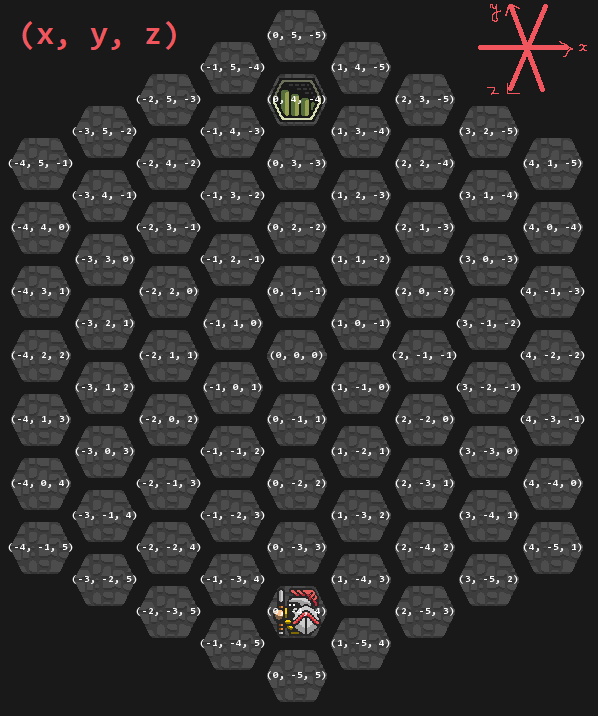

# General Remarks

## Hexagonal Coordinates

I followed description of this article: [Hexagonal Grids, by Red Blob Games](https://www.redblobgames.com/grids/hexagons/). Here is a plot of what it looks like:

## Game Assets

Game assets such as tile and demon sprites can be obtained from the application
APK archive, thanks to [Apktool](https://ibotpeaches.github.io/Apktool/).
